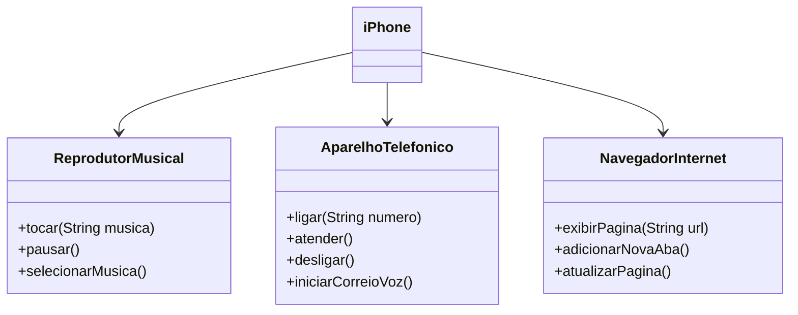

# Iphone
 Modelagem e Diagramação de um Componente iPhone

## POO - Desafio
Com base no vídeo de lançamento do iPhone de 2007 (link abaixo), elaborar a diagramação das classes e interfaces. Implementar classes e interfaces em Java.

[Lançamento iPhone 2007](https://www.youtube.com/watch?v=9ou608QQRq8)

#### Funcionalidades
1. **Reprodutor Musical**
   - Métodos: `tocar(String musica)`, `pausar()`, `selecionarMusica()`
2. **Aparelho Telefônico**
   - Métodos: `ligar(String numero)`, `atender()`, `desligar()`, `iniciarCorreioVoz()`
3. **Navegador na Internet**
   - Métodos: `exibirPagina(String url)`, `adicionarNovaAba()`, `atualizarPagina()`
  
### Exemplo de Diagrama UML (Mermaid)

